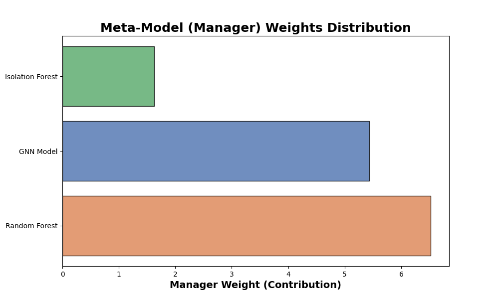
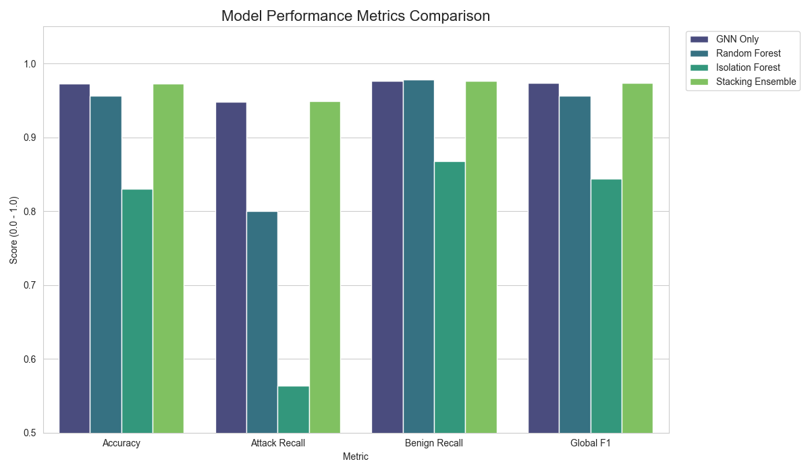
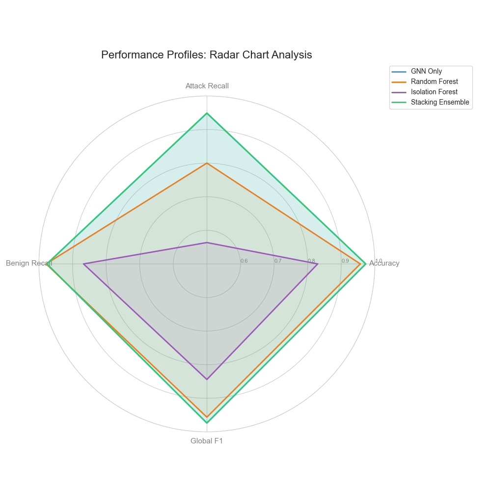

# API Guard: AI-Powered HTTP Request Classifier

API Guard is an intelligent intrusion detection engine designed to classify **HTTP API Requests** as either "Benign" or "Attack" in real-time. The system leverages a **Stacking Ensemble** architecture, combining the structural analysis of Graph Neural Networks (GNN) with the statistical robustness of Random Forest and Isolation Forest models.

## 🚀 System Architecture

The system utilizes a distributed containerized environment:

* **FastAPI Backend:** Entry point for receiving HTTP logs and providing real-time status updates via persistent job IDs.
* **Redis Queue:** Acts as the message broker for asynchronous task distribution and processing.
* **ML Worker:** The computational engine that transforms raw HTTP data into graph and vector representations for multi-model inference.
* **Nginx Frontend:** A web dashboard for submitting requests and visualizing live threat detection results.

## 📁 Project Structure & Component Roles

### 1. Core Logic (`src/`)

* **`features.py`**: Defines the **66-dimensional** node feature vector. It handles one-hot encoding for node types and status codes, and calculates critical security ratios like URL encoding and special character frequency.
* **`graph_builder.py`**: Recursively traverses JSON/HTTP structures to build a graph representation where every key and value is a node, preserving the structural hierarchy of the API request.
* **`vector_builder.py`**: An optimized engine that extracts Graph Feature Vectors (GFV) without the overhead of full graph edge construction, used for traditional ML models.
* **`model.py`**: Defines the **GNNClassifier** architecture using GCN (Graph Convolutional Network) layers and global mean pooling for graph-level classification.
* **`data_loader.py`**: The entry point of the data pipeline. It extracts raw `7z` files, cleans labels to prevent leakage, and creates stratified train/validation/test splits in Parquet format.
* **`train.py`**: Orchestrates the training process for the GNN model, including data batching via PyTorch Geometric Loaders.
* **`train_random_forest.py`**: Trains the Random Forest classifier on tabular Graph Feature Vectors (GFVs).
* **`train_isolation_forest.py`**: Trains and calibrates the Isolation Forest for unsupervised anomaly detection using a specific min-max score normalization.
* **`train_stacking.py`**: Trains the final **Meta-Classifier** (Logistic Regression) which learns how to best weight the predictions from all sub-models.
* **`evaluate_models.py`**: Generates comprehensive performance reports and metrics for each individual model and the final ensemble.
* **`create_images.py`**: create images for the readme and for the report.

### 2. Infrastructure & Deployment

* **`backend/`**: Contains `main.py`, the FastAPI server logic that handles the `/analyze` and `/status` endpoints.
* **`worker/`**: Contains `tasks.py`, the worker logic that loads models into memory and processes the task queue.
* **`frontend/`**: Contains the Nginx web dashboard files.
* **`models/`**: Storage for pre-trained weights (`.pth` for GNN, `.pkl` for RF/IF/Stacking meta-learner).
* **`data/`**: Divided into `raw` (source 7z files) and `processed` (final Parquet splits in the `splits/` subdirectory).
* **`reports/`**: Visualizations, figures, and confusion matrices generated during evaluation.
* **`Dockerfile`**: Defines the Python 3.9 environment, dependencies, and explicit copying of package init files to ensure correct module resolution.
* **`docker-compose.yml`**: Orchestrates the microservices, including the Redis broker and shared volumes for the `/app` root and `/models`.

## 🛠 Setup and Deployment

### Step 1: Data Initialization & Extraction

1. Place your raw `.7z` dataset files into the `data/raw/` directory.
2. Run the data loader to extract, label, and split the data into Parquet format:
```bash
python src/data_loader.py

```


### Step 2: Training the Machine Learning Pipeline

To generate the model weights found in the `models/` directory, run the following scripts in sequence:

```bash
# Train base classifiers
python src/train.py                  # GNN Model
python src/train_random_forest.py    # Random Forest
python src/train_isolation_forest.py # Isolation Forest

# Train the final Stacking Manager
python src/train_stacking.py

```


### Step 3: Performance Evaluation

After training, verify the individual and ensemble results using the test split:

```bash
python src/evaluate_models.py

```


### Step 4: Full System Launch (Docker)

Deploy the real-time detection stack:

```bash
# Clean previous state and start all containers
docker-compose down --volumes
docker-compose up --build

```

* **Dashboard**: `http://localhost`
* **API Documentation**: `http://localhost:8000/docs`

## 🔍 Real-Time Inference Process

1. **API Ingestion**: The API validates the request and enqueues a processing task into Redis.
2. **Feature Engineering**: The Worker reconstructs the raw HTTP format and builds both a graph and a tabular feature vector (66-dim).
3. **Parallel Inference**: The GNN analyzes structural anomalies, while the RF and IF analyze statistical outliers.
4. **Final Decision**: The Stacking Manager provides the final verdict based on the weighted confidence of all sub-models.

## 📊 Conclusions & Results

The evaluation demonstrates the high performance of the ensemble approach. By using a Weighted F1-Score and analyzing both Attack and Benign Recall, we can see the overall balance the model achieves:

| Model | Global Accuracy | Attack Recall | Benign Recall | **Global F1-Score** | False Alarm Rate (FPR) |
| --- | --- | --- | --- | --- | --- |
| **GNN Only** | **97.29%** | 94.85% | 97.64% | **0.9736** | 2.36% |
| **Random Forest** | 95.67% | 80.02% | **97.86%** | 0.9562 | **2.13%** |
| **Isolation Forest** | 82.99% | 56.36% | 86.73% | 0.8440 | 13.26% |
| **Stacking Ensemble** | 97.28% | **94.91%** | 97.62% | **0.9735** | 2.38% |





### Summary

* **GNN (Graph Neural Network)** provides an exceptional balance, delivering the highest Global F1-Score (**0.9736**) by capturing complex structural relationships within the HTTP requests.
* **Random Forest** remains the most precise model for legitimate traffic, achieving the highest Benign Recall (**97.86%**) and the lowest False Alarm Rate (**2.13%**).
* **Isolation Forest** serves as an effective anomaly detector, identifying deviations in request patterns that supervised models might overlook.
* **The Stacking Ensemble** (Final Result) achieves a **Global Accuracy of 97.28%** and the highest Attack Recall (**94.91%**).

### 🛡️ Why Stacking is Superior for Production

While the GNN and Stacking Ensemble show nearly identical results on the test set, the **Stacking Ensemble is the preferred choice for real-world deployment** due to its robustness against **Zero-Day Attacks**:

1. **Structural Diversity:** Unlike the GNN which relies on graph patterns, the Stacking model incorporates the **Isolation Forest**, an **Unsupervised** model. This allows the system to flag requests that look "weird" statistically, even if they don't match known attack signatures or graph structures.
2. **Generalization:** By combining multiple architectures (Trees, Graphs, and Anomalies), the ensemble reduces the risk of overfitting to the training data. This diversity significantly increases the probability of detecting novel, previously unseen attack vectors that a single model might miss.
3. **Balanced Defense:** The Stacking layer effectively moderates the GNN’s sensitivity with the Random Forest’s precision, ensuring high-security coverage while maintaining a low impact on legitimate user experience.
