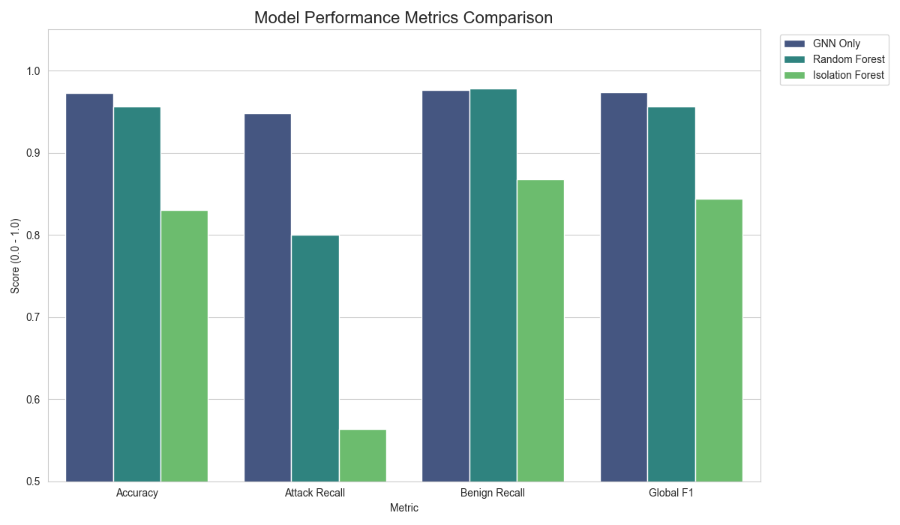
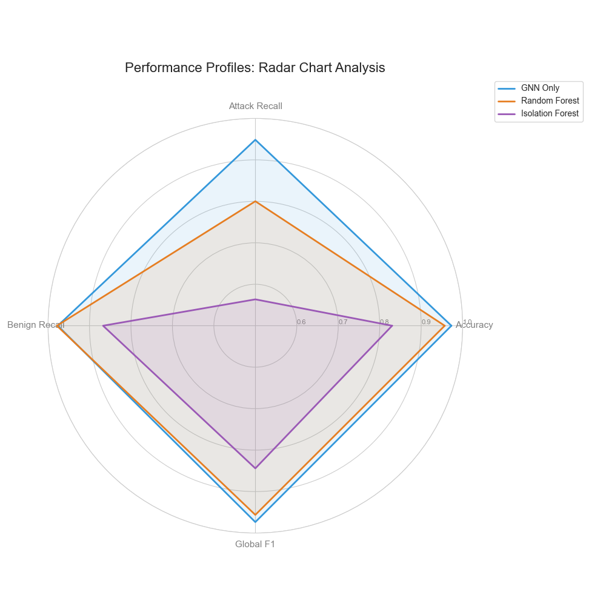

# API Guard: AI-Powered HTTP Request Classifier

API Guard is an intelligent intrusion detection engine designed to classify **HTTP API Requests** as either "Benign" or "Attack" in real-time. The system use Graph Neural Networks (GNN).
## 🚀 System Architecture

The system utilizes a distributed containerized environment:

* **FastAPI Backend:** Entry point for receiving HTTP logs and providing real-time status updates via persistent job IDs.
* **Redis Queue:** Acts as the message broker for asynchronous task distribution and processing.
* **ML Worker:** The computational engine that transforms raw HTTP data into graph and vector representations for multi-model inference.
* **Nginx Frontend:** A web dashboard for submitting requests and visualizing live threat detection results.

## 📁 Project Structure & Component Roles

### 1. Core Logic (`src/`)

* **`features.py`**: Defines the **66-dimensional** node feature vector. It handles one-hot encoding for node types and status codes, and calculates critical security ratios like URL encoding and special character frequency.
* **`graph_builder.py`**: Recursively traverses JSON/HTTP structures to build a graph representation where every key and value is a node, preserving the structural hierarchy of the API request.
* **`vector_builder.py`**: An optimized engine that extracts Graph Feature Vectors (GFV) without the overhead of full graph edge construction, used for traditional ML models.
* **`gnn_model.py`**: Defines the **GNNClassifier** architecture using GCN (Graph Convolutional Network) layers and global mean pooling for graph-level classification.
* **`data_loader.py`**: The entry point of the data pipeline. It extracts raw `7z` files, cleans labels to prevent leakage, and creates stratified train/validation/test splits in Parquet format.
* **`train_gnn.py`**: Orchestrates the training process for the GNN model, including data batching via PyTorch Geometric Loaders.
* **`train_random_forest.py`**: Trains the Random Forest classifier on tabular Graph Feature Vectors (GFVs).
* **`train_isolation_forest.py`**: Trains and calibrates the Isolation Forest for unsupervised anomaly detection using a specific min-max score normalization.
* **`evaluate_models.py`**: Generates comprehensive performance reports and metrics for each individual model and the final ensemble.
* **`create_images.py`**: create images for the readme and for the report.

### 2. Infrastructure & Deployment

* **`backend/`**: Contains `main.py`, the FastAPI server logic that handles the `/analyze` and `/status` endpoints.
* **`worker/`**: Contains `tasks.py`, the worker logic that loads models into memory and processes the task queue.
* **`frontend/`**: Contains the Nginx web dashboard files.
* **`models/`**: Storage for pre-trained weights (`.pth` for GNN, `.pkl` for RF/IF/Stacking meta-learner).
* **`data/`**: Divided into `raw` (source 7z files) and `processed` (final Parquet splits in the `splits/` subdirectory).
* **`reports/`**: Visualizations, figures, and confusion matrices generated during evaluation.
* **`Dockerfile`**: Defines the Python 3.9 environment, dependencies, and explicit copying of package init files to ensure correct module resolution.
* **`docker-compose.yml`**: Orchestrates the microservices, including the Redis broker and shared volumes for the `/app` root and `/models`.

## 🛠 Setup and Deployment

### Step 1: Data Initialization & Extraction

1. Place your raw `.7z` dataset files into the `data/raw/` directory.
2. Run the data loader to extract, label, and split the data into Parquet format:
```bash
python src/data_loader.py
```

### Step 2: Training the Machine Learning Pipeline

To train the models (found in the `models/` directory), run the following scripts:

```bash
# Train all 3 models
python src/train.py                  # GNN Model
python src/train_random_forest.py    # Random Forest
python src/train_isolation_forest.py # Isolation Forest
```

### Step 3: Performance Evaluation

After training, verify the individual models results using the test split:

```bash
python src/evaluate_models.py
```


### Step 4: Full System Launch (Docker)

Deploy the real-time detection stack:

```bash
# Clean previous state and start all containers
docker-compose down --volumes
docker-compose up --build
```

* **Dashboard**: `http://localhost`
* **API Documentation**: `http://localhost:8000/docs`

## 🔍 Real-Time Inference Process

1. **API Ingestion**: The API validates the request and enqueues a processing task into Redis.
2. **Feature Engineering**: The Worker reconstructs the raw HTTP format and builds a graph.
3. **Parallel Inference**: The GNN analyzes structural anomalies, and return a decision.

## 📊 Dataset & Training Methodology

The project utilizes a large-scale, heterogeneous dataset aggregated from four distinct sources (Dataset 1-4) to ensure the model generalizes well across different API architectures and attack patterns.

### Data Partitioning

To ensure absolute isolation and prevent data leakage, the data was strictly partitioned into three phases:

1. **Training Set:** Used for the initial training of the base models (GNN, Random Forest, and Isolation Forest).
2. **Validation Set (Stacking):** Used for Validation for the 3 models.
3. **Test Set:** A "clean slate" dataset used only for the final evaluation to report the 97.29% accuracy.

### Detailed Breakdown

| Phase | Usage | Total Samples | Malware (Attack) Samples |
| --- | --- | --- | --- |
| **Base Training** | GNN, RF, IF Training | **378,543** | ~47,337 (12.5%) |
| **Validation Phase** | GNN, RF, IF Validation | **54,006** | ~6,750 (12.5%) |
| **Final Evaluation** | Unseen Testing | **107,508** | **13,234 (12.3%)** |


## 📊 Conclusions & Results

The final evaluation (on the **107,508 unseen test samples**) demonstrates the high performance of the GNN approach. By using a Weighted F1-Score and analyzing both Attack and Benign Recall, we can see the overall balance the model achieves:

| Model | Global Accuracy | Attack Recall | Benign Recall | **Global F1-Score** | False Alarm Rate (FPR) |
| --- | --- | --- | --- | --- | --- |
| **GNN Only** | **97.29%** | **94.85%** | 97.64% | **0.9736** | 2.36% |
| **Random Forest** | 95.67% | 80.02% | **97.86%** | 0.9562 | **2.13%** |
| **Isolation Forest** | 82.99% | 56.36% | 86.73% | 0.8440 | 13.26% |






### Summary

* **GNN (Graph Neural Network)** provides an exceptional balance, delivering the highest Global F1-Score (**0.9736**) by capturing complex structural relationships within the HTTP requests.
* **Random Forest** remains the most precise model for legitimate traffic, achieving the highest Benign Recall (**97.86%**) and the lowest False Alarm Rate (**2.13%**).
* **Isolation Forest** serves as an effective anomaly detector, identifying deviations in request patterns that supervised models might overlook.

